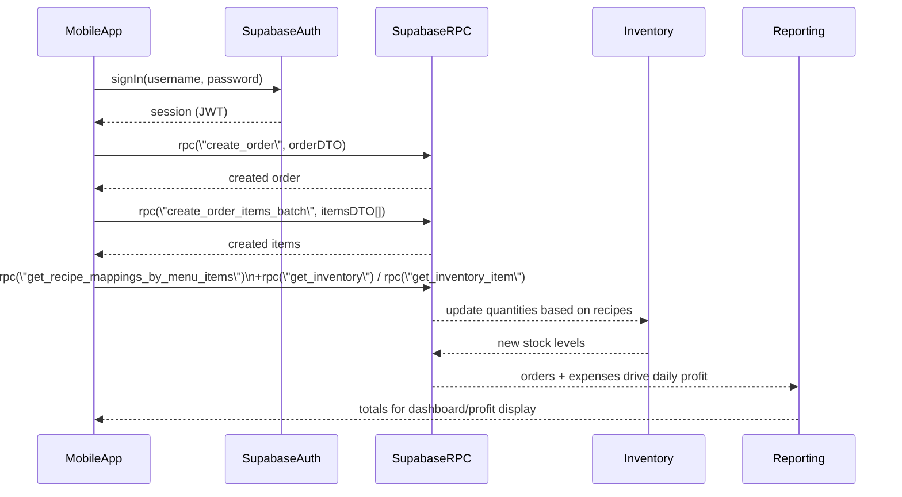

## Snack Island Mobile POS – Supabase API Overview

This folder documents the **exact Supabase-facing API and data contracts** used by the Snack Island POS so a **dedicated mobile app** can talk directly to Supabase and behave the same as the web POS.

- **Backend**: Supabase (Postgres + Auth + RPCs)
- **Frontend reference**: Vue 3 app under `src/`
- **Main POS flows covered here**:
  - Orders and order queue
  - Menu and recipe mappings to inventory
  - Inventory, stock logic, and change logs
  - Discounts, expenses, and profit
  - Auth and users/roles

Use this documentation together with the existing project plan in `Plan.md`.

### Files in this folder

- `data-models.md` – Core data models / DTOs the mobile app should mirror (orders, order items, menu items, inventory, discounts, expenses, etc.).
- `orders-and-queue.md` – All order-related operations (create, items, status updates, queue behaviour, inventory interaction).
- `menu-and-recipes.md` – Menu catalogue, recipe maps, and menu ranks.
- `inventory-and-logs.md` – Inventory CRUD, stock logic, and inventory change logs.
- `discounts-and-expenses.md` – Discounts and expenses, including how they affect profit.
- `auth-and-users.md` – Auth flows and user/role handling.

### High-level flow (mobile → Supabase → inventory & metrics)

### Conventions

- **All endpoints are documented as Supabase calls**, not custom HTTP routes (e.g. `supabase.rpc('create_order', {...})`).
- **Request / response DTOs** are defined in `src/models/*.ts`. This folder re-states them in JSON form for mobile developers.
- Auth is assumed to use Supabase’s official SDK for your mobile platform (e.g. Flutter, React Native, etc.) with the same patterns as in `src/services/authService.ts`.

